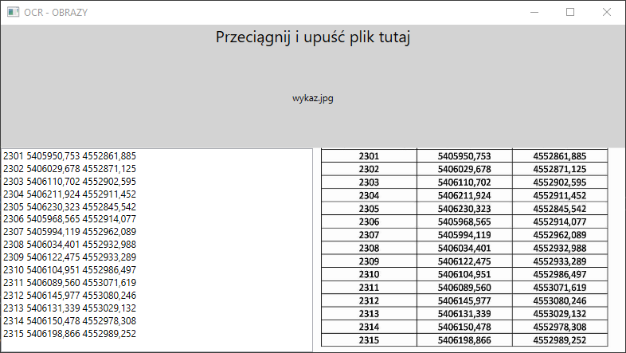

# OCR DLA OBRAZÓW 
## Informacje
Projekt rozpoznający tekst z obrazów. Wymagany jest folder 'tesseractPol' wraz z plikiem 'pol.traineddata' w tym samym folderze co plik wykonywalny .exe

## Przykład

## Skompilowany program 
[Skompilowany program](./OCR_IMAGE/Program/OCR_IMAGE.exe)
